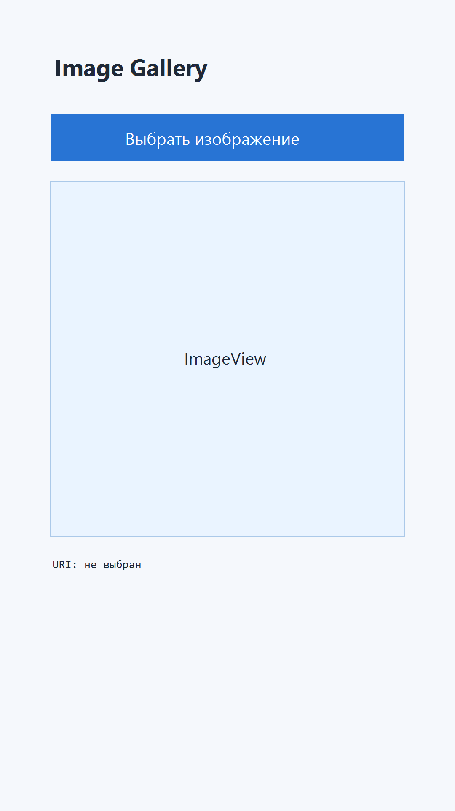
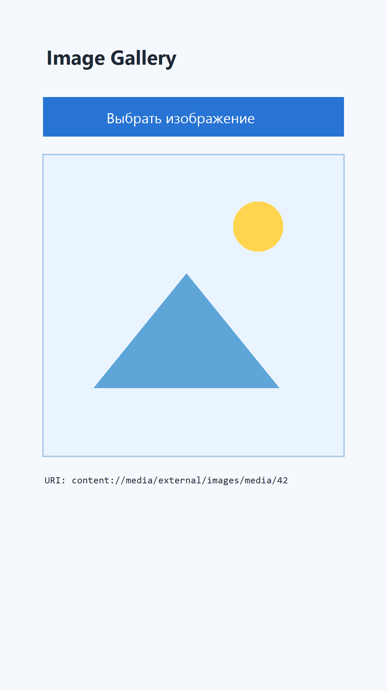

# Image Gallery App

Мобильное приложение на Kotlin для выбора изображения из галереи, отображения выбранного изображения и вывода его URI.

## Реализовано

- Кнопка `Выбрать изображение / Choose image`
- Отображение изображения в `ImageView`
- Отображение URI в `TextView`
- Локализация интерфейса: `ru` и `en`
- Выбор изображения через `Intent.ACTION_PICK`
- Сохранение выбранного URI в `SharedPreferences`
- Использование `Fragment` для экрана с изображением
- Верстка на `ConstraintLayout`
- Кастомная иконка приложения (adaptive icon + fallback)

## Структура

- `MainActivity` содержит контейнер `FragmentContainerView`
- `ImagePickerFragment`:
  - запускает системный пикер изображений
  - сохраняет URI в `SharedPreferences`
  - восстанавливает URI при повторном открытии приложения

## Скриншоты

### 1) Начальное состояние (изображение не выбрано)

### 2) После выбора изображения

## Ссылка на репозиторий

Добавьте URL вашего репозитория после публикации, например:

`https://github.com/<username>/image-gallery-app`

